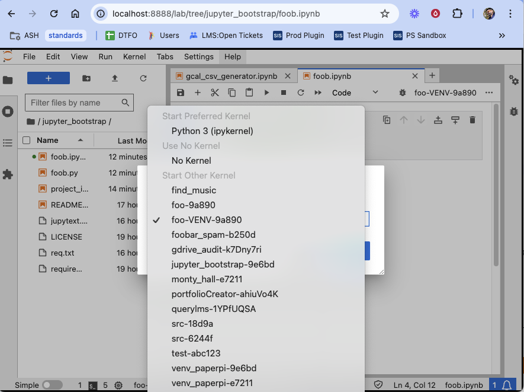

# Deprecated and no longer maintaned

This script is no longer maintained and has been replaced with [pyenv_utilities](https://github.com/txoof/pyenv_utilities).

# Jupyter Bootstrap

Create a virtual environment in the current directory and create a Jupyter-lab kernel for that venv. Optionally setup [Jupytext](https://jupytext.readthedocs.io/en/latest/) to automatically convert Jupyter Lab `.ipynb` files into flat python `.py` files.

## Quick Start

Jupyter Bootstrap should reside in the root of your project. It will create a virtual environment in root of the project folder. 

```text
📁 my_project ← project root
├─ README.md
├─ requirements.txt
├─ 📁 project_files ← project files
│  ├─ foo.py
│  └─ foo.ipynb
│
├─ 📁 jupyter_bootstrap 
│  └─ project_init.sh
└─ 📁 my_project-VENV-d98f0 ← generated virtual environment
```

### Add Jupyter Bootstrap as submodule

Adding `jupyter_bootstrap` as a git submodule make it easy to update to the latest version of the script with `cd jupyter_bootstrap; git pull`.

Add Jupyter Bootstrap as a git submodule:

```shell
cd /src/my_project_root/
git submodule add https://github.com/txoof/jupyter_bootstrap.git
```

### Bootstrap a virtual environment

After installing the `jupyter_bootstrap` repo run the following command to build a virtual environment and add a jupyter kernel and add the [Jupytext](https://jupytext.readthedocs.io/en/latest/) module to the system python environment.

From the project root:

`./jupyter_bootstrap/project_init.sh -j -t`

### Launch Jupyter Lab and Select Kernel

To take full advantage of Jupyter Lab's file browser and ability to switch kernels, start Jupyter Lab in the directory above your project directory. Open your browser to https://localhost:8888, browse to your project and open a `.ipynb`. If you've insalled Jupytext, you can also open `.py` files.

```text
📁 src ← start jupyter lab here
├─ 📁 my_project
│  ├─ 📁 assets
│  ├─ 📁 jupyter_bootstrap
│  └─ 📁 my_project-VENV-d98f0
├─ 📁 other_project
└─ 📁 z_foobar
```

#### Launch Jupyter Lab

```shell
cd ~/src
jupyter lab
```

#### Select a kernel

From an open `.ipynb`, select the appropriate kernel for this project by clicking in the top right corner of the notebook:



## Usage

```text
  Create a development environment for this project

  usage:
  $ ./project_init.sh [options]

  options:
  -c: create the virtual environment
  -j: create the virtual environment and add jupyter kernel
  -t: install Jupytext and add configuration file for converting .ipynb to .py
  -p: purge the virtual environment and clean up kernel specs
  --info: virtual environment information
  -h: This help screen
```

## Requirements

* Python 3
* Jupyter Lab installed in your system Python environment
* Git
